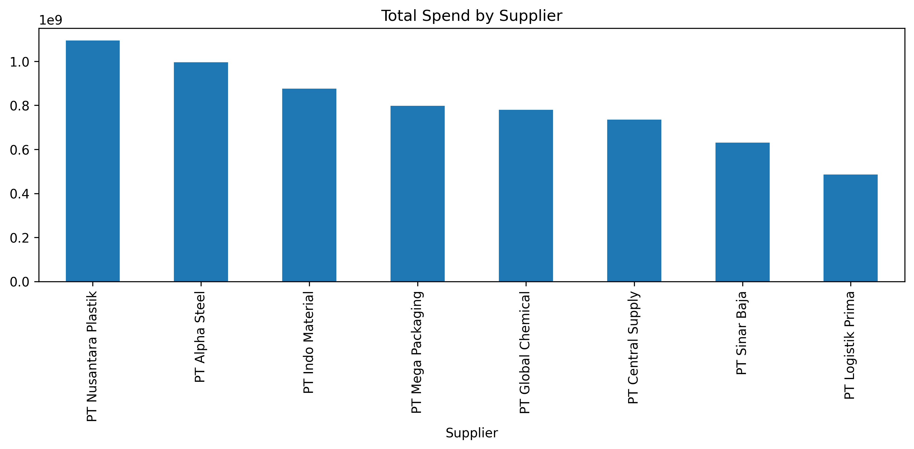
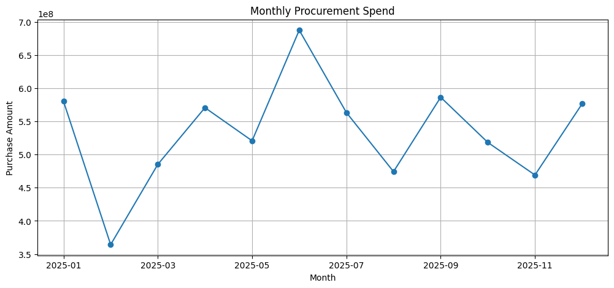

# 📦 Procurement Spend Analysis

## Overview

This project demonstrates procurement spend analysis using Python and a simulated procurement dataset. The analysis helps identify supplier spending patterns, purchasing trends, procurement KPIs, and opportunities for cost optimization.

---

## 🎯Objectives

- Analyze procurement spending by supplier
- Analyze spending by purchasing category
- Monitor monthly procurement trends
- Identify top suppliers using Pareto Analysis
- Generate procurement performance insights

---

## Tools & Libraries

- Python
- Pandas
- NumPy
- Matplotlib
- OpenPyXL
- Google Colab

---

## Dataset

The dataset is a dummy procurement dataset created for learning purposes.

Main attributes include:

- Purchase Date
- Supplier
- Category
- Quantity
- Unit Price
- Purchase Amount

---

## Project Outputs

### Supplier Spend Analysis

---

### Category Spend Analysis

---

### Monthly Procurement Spend

---

### Pareto Analysis

---

## Key Insights

- Identified the suppliers with the highest procurement spending.
- Compared purchasing expenditure across procurement categories.
- Monitored procurement spending trends over time.
- Applied Pareto Analysis to identify suppliers contributing to the majority of procurement costs.

---

## Future Improvements

- ABC Inventory Analysis
- Supplier Performance Evaluation
- Demand Forecasting
- EOQ Analysis
- Procurement Dashboard using Power BI

---

## 👩‍💻 Author

**Meylisa Situmeang**

Engineering Management Student | Supply Chain & Data Analytics
